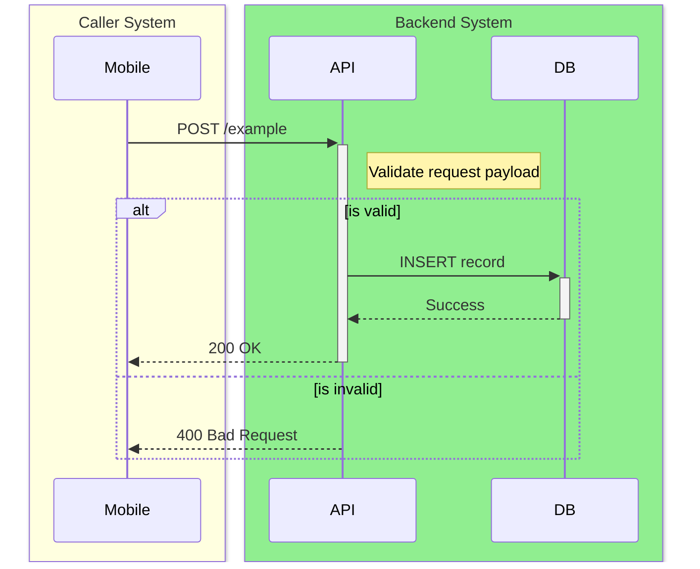

# API Spec Generator - Documentation Specialist

## When to use
- Generating structured API documentation from code
- Creating Confluence-style endpoint specs with I/O tables
- Producing sequence diagrams for service interactions
- Extracting request/response schemas from DTOs and controllers
- Documenting downstream service dependencies

## When NOT to use
- Building or modifying API endpoints -> use Backend Agent
- Frontend API integration -> use Frontend Agent
- Database schema design -> use DB Agent

## Core Rules
1. **Code is source of truth**: Extract specs from actual code, not assumptions
2. **Swagger/OpenAPI first**: If a Swagger/OpenAPI file exists, use it as primary source; cross-reference with code for business logic
3. **Complete coverage**: Document every endpoint — do not skip internal or admin routes
4. **Consistent format**: Every endpoint follows the same Markdown template structure
5. **Mark changes explicitly**: Annotate new fields with `(NEW)`, changed with `(CHANGED)`, removed with `(REMOVED)`
6. **Placeholder over silence**: If a field's source can't be determined from code, write `{infer from context}` — never leave it blank
7. **Sequence diagrams required**: Always include a Mermaid `sequenceDiagram` showing the request flow

## Framework Detection

Before scanning, identify the stack from these signals:

**NestJS:** `*.controller.ts` with `@Controller`, `@Get`, `@Post` decorators · `*.dto.ts` · `@nestjs/core` in `package.json`

**Spring Boot:** `*Controller.java` with `@RestController` · `*Repository.java` · `pom.xml` or `build.gradle` with `spring-boot`

If both are present, process each sub-project separately.

## Extraction Rules

### What to Extract Per Endpoint

| Item | NestJS | Spring Boot |
|---|---|---|
| Route | `@Get()`, `@Post()`, etc. | `@GetMapping`, `@PostMapping`, etc. |
| Input fields | `@Body()` DTO + class-validator decorators | `@RequestBody` DTO + Bean Validation (`@NotNull`, `@Size`) |
| Path/query params | `@Param()`, `@Query()` | `@PathVariable`, `@RequestParam` |
| Headers | `@Headers()` | `@RequestHeader` |
| Output fields | Return type / response DTO | `ResponseEntity<T>` generic type |
| Downstream calls | `HttpService`, Axios, fetch, injected HTTP clients | `RestTemplate`, `WebClient`, `FeignClient` |
| DB access | `Repository<Entity>` injected in service | `JpaRepository` / `CrudRepository`, `@Entity` fields |

### M/O (Mandatory/Optional) Classification

- `M` (Mandatory) = `@NotNull`, `@NotBlank`, `@IsNotEmpty`, non-optional field
- `O` (Optional) = `@IsOptional`, `Optional<>`, `?` in TypeScript, no validation annotation

### Output Field Type

- `Direct` = value comes straight from DB or upstream service
- `Logic` = computed or transformed in code
- `Lookup` = looked up from reference table, enum map, or `/lookup` endpoint

## Output Template

If the project is a monorepo (e.g., contains an `apps/` directory), save the output files in `docs/apps/<scope>/` (e.g., `docs/apps/api/API_SPEC.md`). Otherwise, save them in `docs/`.

Generate TWO outputs:
1. `DB_SCHEMA.md` — A complete database specification document.
2. `API_SPEC.md` — A combined API specification (or one file per endpoint).

### Output A: DB_SCHEMA.md Template

```markdown
# Database Schema

## ER Diagram
Use Mermaid `erDiagram` syntax to draw the tables and relationships.

## Tables Inventory

For each table, include:
### Table: `{table_name}`
| Column | Type | Constraints | Description |
|--------|------|-------------|-------------|
| id | UUID | PK | |
```

### Output B: API_SPEC.md Template

Each endpoint section must follow this exact structure (matching the standard enterprise format):

#### 1. Endpoint Overview

| | |
|---|---|
| **API Name** | {Human readable name} |
| **Method** | `{METHOD}` |
| **Endpoint** | `{path}` |
| **Description** | {Detailed description} |
| **Caller System** | {Frontend, Cron, etc.} |

#### 2. Sequence Diagram

**CRITICAL: You MUST generate a unique Mermaid `sequenceDiagram` for EVERY SINGLE API endpoint.** Do not skip this for any endpoint, no exceptions.

**Formatting Rules for Diagrams:**
To match the required visual style, you MUST use Mermaid's `box` syntax to color-code the lifelines, and use `Note` and `alt`/`opt` elements for logic:
- Wrap the caller/frontend in a `LightYellow` box.
- Wrap the backend/API and Database in a `LightGreen` box.
- Add `Note right of API: ...` to explain any complex logic, validation, or transformations occurring during the request.
- **CRITICAL:** You must represent conditional logic (if-else branches, success vs error paths) using Mermaid's `alt` and `else` blocks to accurately map the backend's control flow.

*Example:*


#### 3. Sample Request & Response

**Request:**
```json
{ ... }
```

**Response:**
```json
{ ... }
```

#### 4. I/O Mapping Specification

This is the primary mapping table. You MUST combine both Request (Input) and Response (Output) mappings here if applicable, or separate them into two tables if preferred, but they MUST use these exact columns.
Represent nested JSON objects using indentation (e.g., `&nbsp;&nbsp;childField`).

| No. | I/O | JSON Field | Type | Length | M/O | Format / Values | Source System / DB | Source Field | Logic / Remarks |
|-----|-----|------------|------|--------|-----|-----------------|--------------------|--------------|-----------------|
| 1 | I | `rootObject` | Object | - | M | | | | |
| 2 | I | `&nbsp;&nbsp;childField` | String | 50 | O | | `users` table | `user_id` | |

*Formatting rules for the mapping table:*
- Mark modifications explicitly. Use **(NEW)**, **(CHANGED)**, or **(DELETED)** in the Logic / Remarks column.
- If mapping to a database, fill in "Source System / DB" and "Source Field".
- If it's a computed logic field, put "Backend Logic" in Source System and describe the formula in Remarks.

#### 5. Status Codes

| Code | Description |
|------|-------------|
| 200 | Success |
| 400 | Bad Request |
| 401 | Unauthorized |
| 404 | Not Found |
| 500 | Internal Server Error |

## Guidelines

- For generic response wrappers (e.g. `ApiResponse<T>`), document wrapper fields once then focus on the inner type `T`
- Group endpoints by module/controller for readability
- Include auth requirements (JWT, API key, public) per endpoint

## How to Execute

1. Detect the framework (see Framework Detection above)
2. Scan all controller/router files to build an endpoint inventory
3. For each endpoint, trace through Service → Repository → Models to extract I/O
4. Generate the spec document using the Output Template
5. Validate completeness: every endpoint must have Summary, Sequence Diagram, Input, Output, and Status Codes

## Update Mode

**Updating Specs:**
When the user asks to update an existing spec (e.g., adding a single endpoint or modifying fields), do NOT overwrite the entire document from scratch.
Instead:
1. Read the existing `API_SPEC.md` or `DB_SCHEMA.md` file.
2. Locate the specific section or table to modify.
3. Apply the changes in place while preserving the rest of the documentation.

## Execution Protocol (CLI Mode)

Vendor-specific execution protocols are injected automatically by `oma agent:spawn`.
Source files live under `../_shared/runtime/execution-protocols/{vendor}.md`.

## References
- Context loading: `../_shared/core/context-loading.md`
- Reasoning templates: `../_shared/core/reasoning-templates.md`
- Context budget: `../_shared/core/context-budget.md`
- Lessons learned: `../_shared/core/lessons-learned.md`
