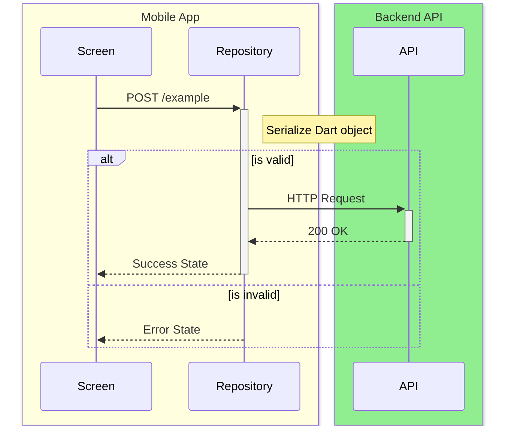

# Flutter API Spec Generator - Mobile Documentation Specialist

## When to use
- Documenting which backend endpoints a Flutter app consumes
- Generating inbound component mappings for backend specs
- Extracting Dart request/response model structures
- Mapping screens to API calls for architecture visibility
- Auditing API surface area of a mobile app

## When NOT to use
- Documenting backend endpoints from server code -> use API Spec Generator
- Building or modifying Flutter features -> use Mobile Agent
- Backend API implementation -> use Backend Agent

## Core Rules
1. **Code is source of truth**: Extract specs from actual Dart code, not assumptions
2. **Complete coverage**: Document every HTTP call — do not skip internal or debug endpoints
3. **Trace the full chain**: Always map Screen → Service/Provider → HTTP call → Endpoint
4. **Consistent format**: Every endpoint follows the same Markdown template structure
5. **Mark optionality correctly**: Nullable Dart fields (`type?`) are Optional; non-nullable are Required
6. **Placeholder over silence**: If a field's purpose can't be determined from code, write `{infer from context}`
7. **Read source, not generated**: For `@JsonSerializable` / Retrofit, read the annotated source class, not `*.g.dart`

## Project Detection

Confirm it's a Flutter project by checking:
- `pubspec.yaml` with `flutter:` SDK dependency
- `lib/` directory present

Then identify the architecture pattern:

| Pattern | Signals |
|---|---|
| **Clean Architecture** | `lib/data/`, `lib/domain/`, `lib/presentation/` folders |
| **MVC / Simple** | `lib/models/`, `lib/services/`, `lib/screens/` or `lib/views/` |
| **BLoC** | `*_bloc.dart`, `*_event.dart`, `*_state.dart` files |
| **Provider / Riverpod** | `ChangeNotifier`, `Provider`, `@riverpod` annotations |
| **GetX** | `GetxController`, `Get.find()`, `.obs` fields |

## HTTP Call Detection

Search for API calls using these signals:

**HTTP packages (check `pubspec.yaml`):**
- `dio` — most common
- `http` — Flutter's built-in HTTP package
- `retrofit` — annotation-based REST client (generates code)
- `chopper` — similar to Retrofit
- `graphql_flutter` — GraphQL

**Where to find calls:**

| Package | Signals | Extract |
|---------|---------|---------|
| dio / http | `.get()`, `.post()`, `.put()`, `.delete()`, `.patch()` | URL, method, headers, data/body, queryParameters |
| retrofit | `@GET`, `@POST`, `@PUT`, `@DELETE` on abstract methods | path from annotation, return type, `@Body` / `@Query` / `@Header` params |
| chopper | `@Get`, `@Post`, etc. on abstract service classes | Same as retrofit |
| GraphQL | query/mutation strings in `gql(...)` or `Query` widget | query name, variables |

## Model Extraction

Find request and response model classes via:
- Files with `fromJson()` / `toJson()` methods
- Classes annotated with `@JsonSerializable` (json_annotation package)
- Files ending in `_model.dart`, `_dto.dart`, `_request.dart`, `_response.dart`
- Freezed classes (`@freezed` annotation)

For each model extract:
- Class name
- All fields: name, Dart type, nullable (`?`) = optional
- JSON key if different from field name (`@JsonKey(name: '...')`)
- Nested model references

## Screen-to-API Mapping

Trace which screens/pages trigger which API calls:
- Screen/page files: `*_screen.dart`, `*_page.dart`, `*_view.dart`
- The service or repository injected into the screen's widget, BLoC, controller, or ViewModel
- Which service methods are called (on button tap, on `initState`, on page load)

Build a mapping: `Screen → Service method → HTTP call → Endpoint`

## Output Format

If the project is a monorepo (e.g., contains an `apps/` directory), save all output files in `docs/apps/<scope>/` (e.g., `docs/apps/mobile/FLUTTER_API_SPEC.md`). Otherwise, save them in `docs/`.

### Output A: API_SPEC.md Template

Each endpoint section must follow this exact structure (matching the standard enterprise format):

#### 1. Endpoint Overview

| | |
|---|---|
| **API Name** | {Human readable name} |
| **Method** | `{METHOD}` |
| **Endpoint** | `{path}` |
| **Description** | {Detailed description} |
| **Flutter Screen** | {Screen that calls this} |
| **Dart Service** | {Repository/Service class} |

#### 2. Sequence Diagram

**CRITICAL: You MUST generate a unique Mermaid `sequenceDiagram` for EVERY SINGLE API endpoint.** Do not skip this for any endpoint, no exceptions.

**Formatting Rules for Diagrams:**
To match the required visual style, you MUST use Mermaid's `box` syntax to color-code the lifelines, and use `Note` and `alt`/`opt` elements for logic:
- Wrap the caller/frontend components (Flutter Screen, Provider) in a `LightYellow` box.
- Wrap the backend/API and Local DB in a `LightGreen` box.
- Add `Note` blocks to explain complex Dart logic, serialization, or Riverpod state updates.
- **CRITICAL:** You must represent conditional logic (if-else branches, success vs error paths) using Mermaid's `alt` and `else` blocks.

*Example:*


#### 3. Sample Request & Response

**Request (Dart Sample):**
```dart
// Code snippet showing the call
```

**Response (JSON):**
```json
{ ... }
```

#### 4. I/O Mapping Specification

This is the primary mapping table. You MUST combine both Request (Input) and Response (Output) mappings here.
Represent nested JSON objects using indentation (e.g., `&nbsp;&nbsp;childField`).

| No. | I/O | JSON Key | Dart Type | Nullable | M/O | Format / Values | Dart Model / Field | Logic / Remarks |
|-----|-----|----------|-----------|----------|-----|-----------------|--------------------|-----------------|
| 1 | I | `rootObject` | Object | No | M | | | |
| 2 | O | `&nbsp;&nbsp;childField` | String | Yes | O | | `UserModel.userId` | |

*Formatting rules for the mapping table:*
- Mark modifications explicitly. Use **(NEW)**, **(CHANGED)**, or **(DELETED)** in the Logic / Remarks column.
- Map the JSON Key to the corresponding Dart Model property.

### Output C: Local Database Schema (`FLUTTER_DB_SCHEMA.md`)

If a local database is detected (e.g., Drift/SQLite, Hive, Isar), generate a schema document.

```markdown
# Local Database Schema

## ER Diagram
Use Mermaid `erDiagram` syntax to draw the local tables and relationships.

## Tables / Collections

### Table: `transactions`
| Column | Dart Type | SQL/DB Type | Nullable |
|--------|-----------|-------------|----------|
| id | String | TEXT | No |
```

### Output B: Project Structure Summary (`FLUTTER_STRUCTURE.md`)

Must include these sections:

| Section | Content |
|---------|---------|
| Architecture Pattern | Detected pattern name |
| HTTP Package | dio / http / retrofit / etc. |
| Screens Inventory | Table: Screen, File, API Calls Made |
| Services / Repositories | Table: Class, File, Endpoints It Calls |
| Models Inventory | Table: Model, File, Used As |
| API Base URL | Extracted from BaseOptions, .env, or constants |
| Endpoints Summary | Table: Method, Path, Called From, Request Model, Response Model |

## Guidelines

- If the base URL is in a `.env` file or constants file, find and include it
- For Retrofit, read the abstract class for the interface — not the generated `*.g.dart`
- If a model is used both as request and response, note both usages
- If GraphQL is used, extract query/mutation names and their variables as the "endpoint" equivalent

## How to Execute

1. Detect the project structure (see Project Detection above)
2. Scan for all HTTP packages and calls (see HTTP Call Detection)
3. Extract all models (see Model Extraction)
4. Map screens to API calls (see Screen-to-API Mapping)
5. Generate Output A (Per-Endpoint Doc) and Output B (Structure Summary)
6. Validate completeness: every HTTP call must appear in both outputs

## Update Mode

**Updating Specs:**
When the user asks to update an existing spec (e.g., adding a single endpoint or modifying fields), do NOT overwrite the entire document from scratch.
Instead:
1. Read the existing `FLUTTER_API_SPEC.md` or `FLUTTER_DB_SCHEMA.md` file.
2. Locate the specific section or table to modify.
3. Apply the changes in-place while preserving the rest of the documentation.

## Execution Protocol (CLI Mode)

Vendor-specific execution protocols are injected automatically by `oma agent:spawn`.
Source files live under `../_shared/runtime/execution-protocols/{vendor}.md`.

## References
- Context loading: `../_shared/core/context-loading.md`
- Reasoning templates: `../_shared/core/reasoning-templates.md`
- Context budget: `../_shared/core/context-budget.md`
- Lessons learned: `../_shared/core/lessons-learned.md`
