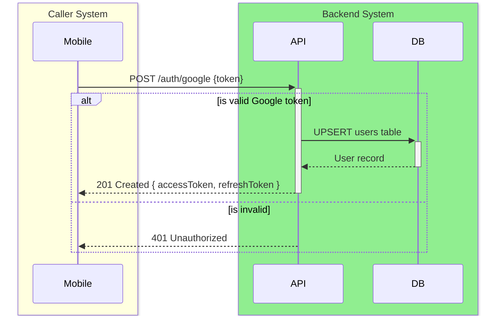
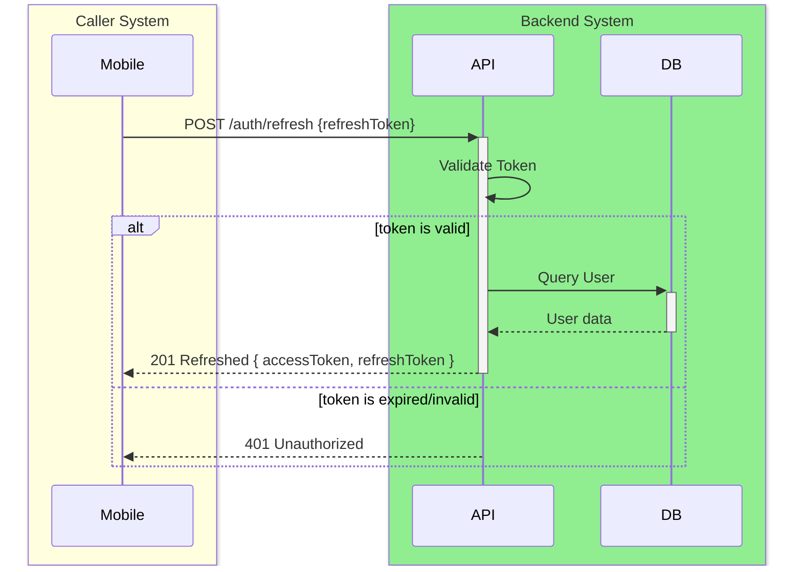
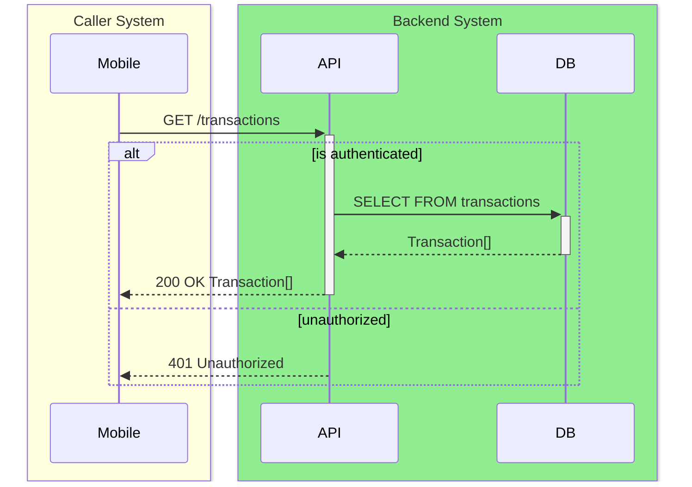
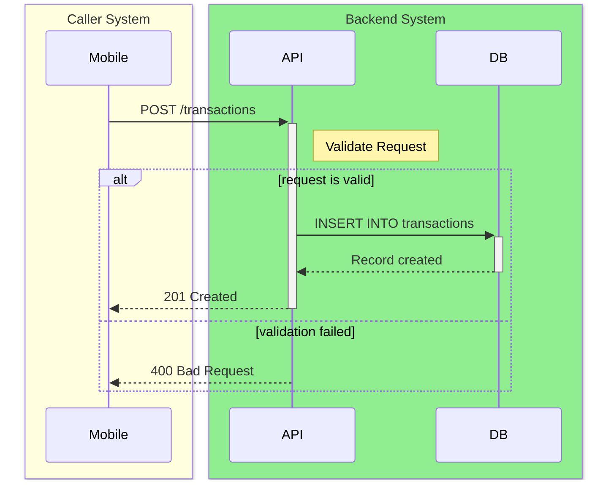
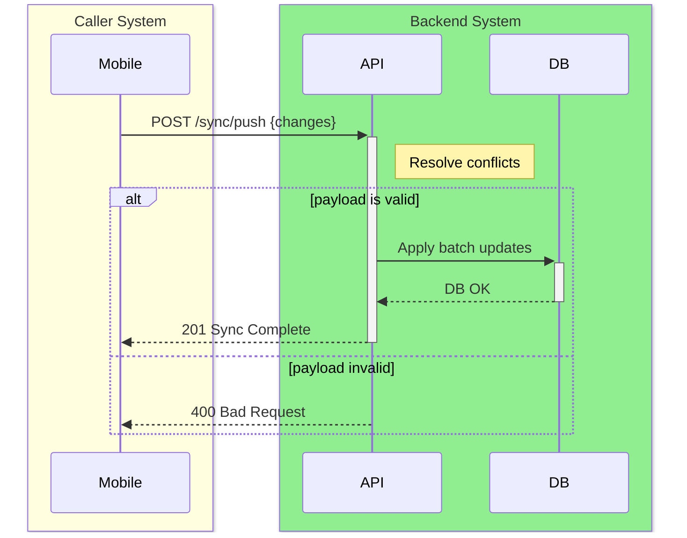

# API Specification

**Microservice:** Backend API (NestJS)

---

## 1. Authentication

### `POST /auth/google`

#### 1. Endpoint Overview
| | |
|---|---|
| **API Name** | Google Authentication |
| **Method** | `POST` |
| **Endpoint** | `/auth/google` |
| **Description** | Authenticate user using a Google provider ID token, creating a new user record if one doesn't exist. |
| **Caller System** | Mobile App |

#### 2. Sequence Diagram


#### 3. Sample Request & Response
**Request:**
```json
{
  "providerToken": "ya29.a0AfB_byC..."
}
```

**Response:**
```json
{
  "accessToken": "eyJhbG...",
  "refreshToken": "eyJhbG..."
}
```

#### 4. I/O Mapping Specification
| No. | I/O | JSON Field | Type | Length | M/O | Format / Values | Source System / DB | Source Field | Logic / Remarks |
|-----|-----|------------|------|--------|-----|-----------------|--------------------|--------------|-----------------|
| 1 | I | `providerToken` | String | - | M | JWT String | | | Google ID token from Firebase |
| 2 | O | `accessToken` | String | - | M | JWT String | Backend Logic | | Generated JWT access token |
| 3 | O | `refreshToken` | String | - | M | JWT String | Backend Logic | | Generated JWT refresh token |

#### 5. Status Codes
| Code | Description |
|------|-------------|
| 201 | Created / Authenticated |
| 400 | Bad Request |
| 401 | Unauthorized (Invalid Google Token) |

---

### `POST /auth/refresh`

#### 1. Endpoint Overview
| | |
|---|---|
| **API Name** | Refresh Token |
| **Method** | `POST` |
| **Endpoint** | `/auth/refresh` |
| **Description** | Refresh the authentication tokens using a valid refresh token. |
| **Caller System** | Mobile App |

#### 2. Sequence Diagram


#### 3. Sample Request & Response
**Request:**
```json
{
  "refreshToken": "eyJhbG..."
}
```

**Response:**
```json
{
  "accessToken": "eyJhbG...",
  "refreshToken": "eyJhbG..."
}
```

#### 4. I/O Mapping Specification
| No. | I/O | JSON Field | Type | Length | M/O | Format / Values | Source System / DB | Source Field | Logic / Remarks |
|-----|-----|------------|------|--------|-----|-----------------|--------------------|--------------|-----------------|
| 1 | I | `refreshToken` | String | - | M | JWT String | | | Active refresh token |
| 2 | O | `accessToken` | String | - | M | JWT String | Backend Logic | | New JWT access token |
| 3 | O | `refreshToken` | String | - | M | JWT String | Backend Logic | | New JWT refresh token |

#### 5. Status Codes
| Code | Description |
|------|-------------|
| 201 | Tokens Refreshed |
| 401 | Unauthorized (Expired/Invalid Token) |

---

## 2. Transactions

### `GET /transactions`

#### 1. Endpoint Overview
| | |
|---|---|
| **API Name** | Get Transactions |
| **Method** | `GET` |
| **Endpoint** | `/transactions` |
| **Description** | Retrieve the list of transactions for the authenticated user. |
| **Caller System** | Mobile App |

#### 2. Sequence Diagram


#### 3. Sample Request & Response
**Request:**
*(Empty Body)*

**Response:**
```json
[
  {
    "id": "123e4567-e89b-12d3-a456-426614174000",
    "transactionType": "expense",
    "amountBase": 150.00,
    "originalAmount": 100.00,
    "originalCurrency": "USD",
    "exchangeRate": 1.5,
    "categoryId": "223e4567-e89b-12d3-a456-426614174000"
  }
]
```

#### 4. I/O Mapping Specification
| No. | I/O | JSON Field | Type | Length | M/O | Format / Values | Source System / DB | Source Field | Logic / Remarks |
|-----|-----|------------|------|--------|-----|-----------------|--------------------|--------------|-----------------|
| 1 | O | `id` | String | 36 | M | UUID | `transactions` table | `id` | |
| 2 | O | `transactionType` | String | 25 | M | `expense`, `income` | `transactions` table | `transaction_type` | |
| 3 | O | `amountBase` | Number | 12,4 | M | Decimal | `transactions` table | `amount_base` | |
| 4 | O | `originalAmount` | Number | 12,4 | M | Decimal | `transactions` table | `original_amount` | |
| 5 | O | `originalCurrency` | String | 3 | M | ISO Currency | `transactions` table | `original_currency` | |
| 6 | O | `exchangeRate` | Number | 10,6 | M | Decimal | `transactions` table | `exchange_rate` | |
| 7 | O | `categoryId` | String | 36 | O | UUID | `transactions` table | `category_id` | Nullable |

#### 5. Status Codes
| Code | Description |
|------|-------------|
| 200 | Success |
| 401 | Unauthorized |

---

### `POST /transactions`

#### 1. Endpoint Overview
| | |
|---|---|
| **API Name** | Create Transaction |
| **Method** | `POST` |
| **Endpoint** | `/transactions` |
| **Description** | Create a new transaction record for the user. |
| **Caller System** | Mobile App |

#### 2. Sequence Diagram


#### 3. Sample Request & Response
**Request:**
```json
{
  "transactionType": "expense",
  "originalAmount": 50.00,
  "originalCurrency": "EUR",
  "exchangeRate": 1.65,
  "rateDate": "2026-04-27",
  "transactionDate": "2026-04-27",
  "categoryId": "223e4567-e89b-12d3-a456-426614174000",
  "note": "Lunch"
}
```

**Response:**
```json
{
  "id": "993e4567-e89b-12d3-a456-426614174000",
  "status": "created"
}
```

#### 4. I/O Mapping Specification
| No. | I/O | JSON Field | Type | Length | M/O | Format / Values | Source System / DB | Source Field | Logic / Remarks |
|-----|-----|------------|------|--------|-----|-----------------|--------------------|--------------|-----------------|
| 1 | I | `transactionType` | String | 25 | M | `expense`, `income` | `transactions` table | `transaction_type` | |
| 2 | I | `originalAmount` | Number | 12,4 | M | Decimal | `transactions` table | `original_amount` | |
| 3 | I | `originalCurrency` | String | 3 | M | ISO Currency | `transactions` table | `original_currency` | |
| 4 | I | `exchangeRate` | Number | 10,6 | M | Decimal | `transactions` table | `exchange_rate` | |
| 5 | I | `rateDate` | String | - | M | YYYY-MM-DD | `transactions` table | `rate_date` | |
| 6 | I | `transactionDate`| String | - | M | YYYY-MM-DD | `transactions` table | `transaction_date` | |
| 7 | I | `categoryId` | String | 36 | O | UUID | `transactions` table | `category_id` | |
| 8 | I | `note` | String | - | O | Text | `transactions` table | `note` | |
| 9 | O | `id` | String | 36 | M | UUID | Backend Logic | | Auto-generated UUID |
| 10| O | `status` | String | - | M | "created" | Backend Logic | | |

#### 5. Status Codes
| Code | Description |
|------|-------------|
| 201 | Created |
| 400 | Validation Failed |
| 401 | Unauthorized |

---

## 3. Sync

### `POST /sync/push`

#### 1. Endpoint Overview
| | |
|---|---|
| **API Name** | Push Local Sync |
| **Method** | `POST` |
| **Endpoint** | `/sync/push` |
| **Description** | Push local offline changes to the backend for synchronization. |
| **Caller System** | Mobile App |

#### 2. Sequence Diagram


#### 3. Sample Request & Response
**Request:**
```json
{
  "changes": [
    {
      "recordType": "transaction",
      "operation": "CREATE",
      "payload": "{...}"
    }
  ]
}
```

**Response:**
```json
{
  "success": true,
  "conflictsResolved": 0
}
```

#### 4. I/O Mapping Specification
| No. | I/O | JSON Field | Type | Length | M/O | Format / Values | Source System / DB | Source Field | Logic / Remarks |
|-----|-----|------------|------|--------|-----|-----------------|--------------------|--------------|-----------------|
| 1 | I | `changes` | Array | - | M | | | | List of queued changes |
| 2 | I | `&nbsp;&nbsp;recordType` | String | 20 | M | `transaction`, `category`| | | Identifies the table |
| 3 | I | `&nbsp;&nbsp;operation` | String | 10 | M | `CREATE`, `UPDATE` | | | Operation to perform |
| 4 | I | `&nbsp;&nbsp;payload` | String | - | M | JSON String | | | Serialized record data |
| 5 | O | `success` | Boolean| - | M | | Backend Logic | | Sync operation result |
| 6 | O | `conflictsResolved`| Integer| - | M | | `conflict_log` table | | Count of conflicts |

#### 5. Status Codes
| Code | Description |
|------|-------------|
| 201 | Sync Complete |
| 400 | Invalid payload |
| 401 | Unauthorized |
