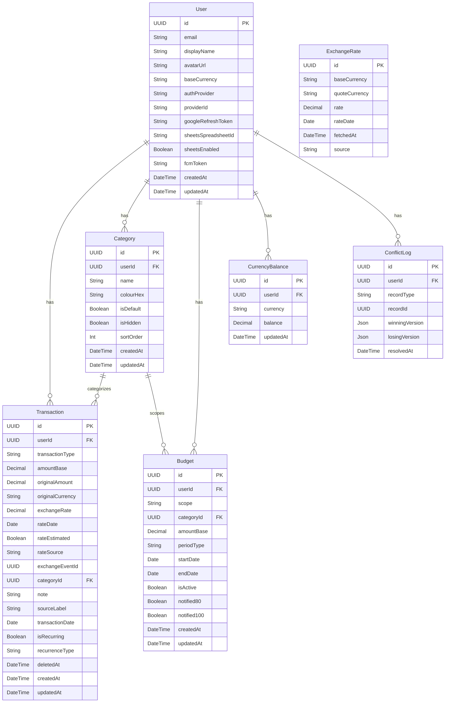

# Database Schema

## ER Diagram

## Tables Inventory

### Table: `users`
| Column | Type | Constraints | Description |
|--------|------|-------------|-------------|
| id | UUID | PK | |
| email | VarChar(255) | UNIQUE | |
| display_name | VarChar(100) | | |
| avatar_url | Text | Nullable | |
| base_currency | VarChar(3) | Default('AUD') | |
| auth_provider | VarChar(10) | | 'google' or 'apple' |
| provider_id | VarChar(255) | | |
| google_refresh_token | Text | Nullable | |
| sheets_spreadsheet_id | Text | Nullable | |
| sheets_enabled | Boolean | Default(false) | |
| fcm_token | Text | Nullable | |
| created_at | DateTime | | |
| updated_at | DateTime | | |

### Table: `transactions`
| Column | Type | Constraints | Description |
|--------|------|-------------|-------------|
| id | UUID | PK | |
| user_id | UUID | FK | References users.id |
| transaction_type | VarChar(25) | | expense, currency_income, currency_exchange_out, currency_exchange_in |
| amount_base | Decimal(12, 4) | | |
| original_amount | Decimal(12, 4) | | |
| original_currency | VarChar(3) | | |
| exchange_rate | Decimal(10, 6) | | |
| rate_date | Date | | |
| rate_estimated | Boolean | Default(false) | |
| rate_source | VarChar(15) | Default('frankfurter') | frankfurter, custom, estimated |
| exchange_event_id | UUID | Nullable | |
| category_id | UUID | FK, Nullable | References categories.id |
| note | Text | Nullable | |
| source_label | Text | Nullable | |
| transaction_date | Date | | |
| is_recurring | Boolean | Default(false) | |
| recurrence_type | VarChar(12) | Nullable | weekly, fortnightly, monthly |
| deleted_at | DateTime | Nullable | For soft deletes |
| created_at | DateTime | | |
| updated_at | DateTime | | |

### Table: `categories`
| Column | Type | Constraints | Description |
|--------|------|-------------|-------------|
| id | UUID | PK | |
| user_id | UUID | FK | References users.id |
| name | VarChar(50) | | |
| colour_hex | VarChar(7) | | |
| is_default | Boolean | Default(false) | |
| is_hidden | Boolean | Default(false) | |
| sort_order | Int | | |
| created_at | DateTime | | |
| updated_at | DateTime | | |

### Table: `budgets`
| Column | Type | Constraints | Description |
|--------|------|-------------|-------------|
| id | UUID | PK | |
| user_id | UUID | FK | References users.id |
| scope | VarChar(10) | | global or category |
| category_id | UUID | FK, Nullable | References categories.id |
| amount_base | Decimal(12, 2) | | |
| period_type | VarChar(12) | | weekly, fortnightly, monthly, custom |
| start_date | Date | | |
| end_date | Date | Nullable | |
| is_active | Boolean | Default(true) | |
| notified_80 | Boolean | Default(false) | |
| notified_100 | Boolean | Default(false) | |
| created_at | DateTime | | |
| updated_at | DateTime | | |

### Table: `exchange_rates`
| Column | Type | Constraints | Description |
|--------|------|-------------|-------------|
| id | UUID | PK | |
| base_currency | VarChar(3) | UNIQUE COMPOSITE | |
| quote_currency | VarChar(3) | UNIQUE COMPOSITE | |
| rate | Decimal(10, 6) | | |
| rate_date | Date | UNIQUE COMPOSITE | |
| fetched_at | DateTime | | |
| source | VarChar(20) | Default('frankfurter') | |

### Table: `currency_balances`
| Column | Type | Constraints | Description |
|--------|------|-------------|-------------|
| id | UUID | PK | |
| user_id | UUID | FK, UNIQUE | References users.id |
| currency | VarChar(3) | UNIQUE | |
| balance | Decimal(12, 4) | | |
| updated_at | DateTime | | |

### Table: `conflict_log`
| Column | Type | Constraints | Description |
|--------|------|-------------|-------------|
| id | UUID | PK | |
| user_id | UUID | FK | References users.id |
| record_type | VarChar(20) | | |
| record_id | UUID | | |
| winning_version | Json | | |
| losing_version | Json | | |
| resolved_at | DateTime | | |
