# Flutter API Consumption

**Base URL:** `http://localhost:3000` (configurable via `.env`)

**Last Updated:** 21 June 2026

---

## 1. Authentication

### `POST /auth/refresh`

#### 1. Endpoint Overview
| | |
|---|---|
| **API Name** | Refresh Token |
| **Method** | `POST` |
| **Endpoint** | `/auth/refresh` |
| **Description** | Refresh the authentication tokens using a stored refresh token. |
| **Flutter Screen** | All Screens (via Dio Interceptor) |
| **Dart Service** | `dio_client.dart` / `AuthInterceptor` |

#### 2. Sequence Diagram
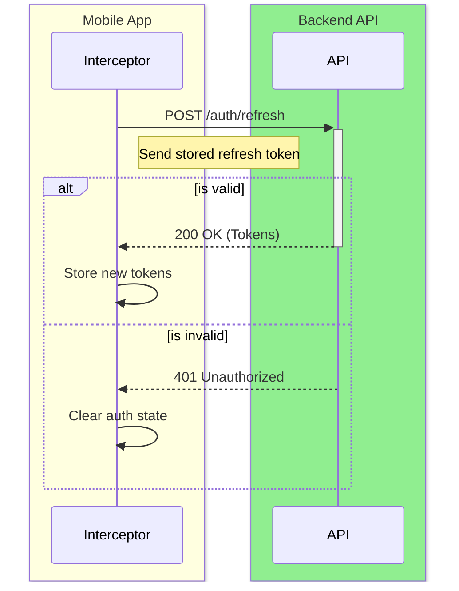

#### 3. Sample Request & Response
**Request (Dart Sample):**
```dart
final response = await dio.post('/auth/refresh', data: {
  'refreshToken': refreshToken,
});
```

**Response (JSON):**
```json
{
  "accessToken": "ey...",
  "refreshToken": "ey..."
}
```

#### 4. I/O Mapping Specification
| No. | I/O | JSON Key | Dart Type | Nullable | M/O | Format / Values | Dart Model / Field | Logic / Remarks |
|-----|-----|----------|-----------|----------|-----|-----------------|--------------------|--------------------|
| 1 | I | `refreshToken` | String | No | M | | | Read from secure storage |
| 2 | O | `accessToken` | String | No | M | | | Saved to memory/storage |
| 3 | O | `refreshToken` | String | No | M | | | Saved to storage |

#### 5. Status Codes
| Code | Description |
|------|-------------|
| 200 | Success |
| 401 | Invalid or expired refresh token |

---

## 2. Sync

### `POST /sync/push`

#### 1. Endpoint Overview
| | |
|---|---|
| **API Name** | Sync Push |
| **Method** | `POST` |
| **Endpoint** | `/sync/push` |
| **Description** | Mobile sends a batch of pending local record changes (insert/update/delete) to the server. |
| **Flutter Screen** | Background (SyncService) |
| **Dart Service** | `SyncService` / `sync_provider.dart` |

#### 2. Sequence Diagram
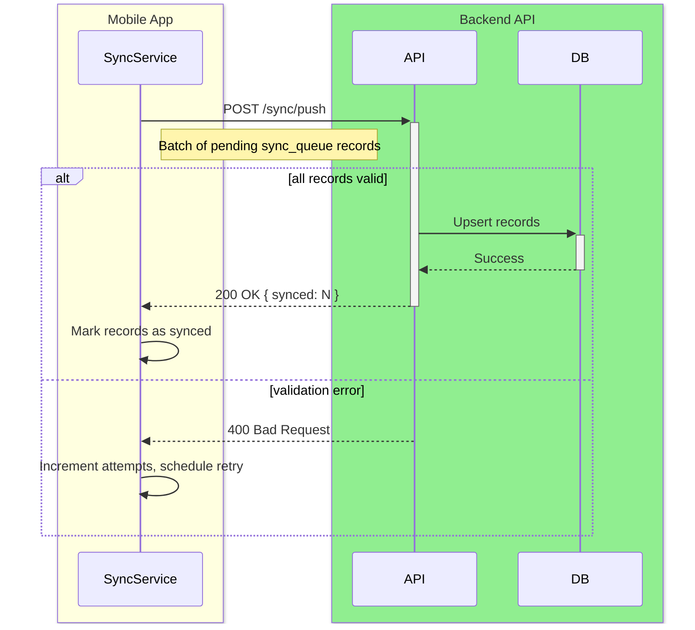

#### 3. Sample Request & Response
**Request (Dart Sample):**
```dart
final response = await dio.post('/sync/push', data: {
  'records': pendingRecords.map((r) => r.toJson()).toList(),
  'clientTimestamp': DateTime.now().toIso8601String(),
});
```

**Response (JSON):**
```json
{
  "synced": 5,
  "conflicts": []
}
```

#### 4. I/O Mapping Specification
| No. | I/O | JSON Key | Dart Type | Nullable | M/O | Format / Values | Dart Model / Field | Logic / Remarks |
|-----|-----|----------|-----------|----------|-----|-----------------|--------------------|--------------------|
| 1 | I | `records` | List | No | M | Array of record objects | `sync_queue` rows | |
| 2 | I | `&nbsp;&nbsp;recordType` | String | No | M | `transaction`, `budget`, `category` | `SyncQueueData.recordType` | |
| 3 | I | `&nbsp;&nbsp;recordId` | String | No | M | UUID | `SyncQueueData.recordId` | |
| 4 | I | `&nbsp;&nbsp;operation` | String | No | M | `insert`, `update`, `delete` | `SyncQueueData.operation` | |
| 5 | I | `&nbsp;&nbsp;payload` | Object | No | M | Full record JSON | `SyncQueueData.payload` | |
| 6 | I | `clientTimestamp` | String | No | M | ISO8601 | | |
| 7 | O | `synced` | int | No | M | Count of accepted records | | |
| 8 | O | `conflicts` | List | No | M | Empty in non-conflict cases | | |

#### 5. Status Codes
| Code | Description |
|------|-------------|
| 200 | Records processed |
| 400 | Validation error in payload |
| 401 | Unauthorized |

---

### `POST /sync/pull`

#### 1. Endpoint Overview
| | |
|---|---|
| **API Name** | Sync Pull |
| **Method** | `POST` |
| **Endpoint** | `/sync/pull` |
| **Description** | Mobile requests all records updated on the server after a given timestamp. |
| **Flutter Screen** | Background (SyncService) |
| **Dart Service** | `SyncService` / `sync_provider.dart` |

#### 2. Sequence Diagram
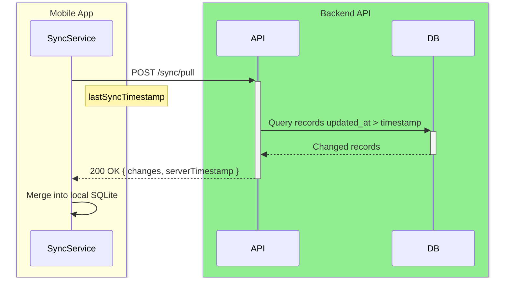

#### 3. Sample Request & Response
**Request (Dart Sample):**
```dart
final response = await dio.post('/sync/pull', data: {
  'lastSyncTimestamp': lastSyncAt.toIso8601String(),
});
```

**Response (JSON):**
```json
{
  "changes": {
    "transactions": [...],
    "categories": [...],
    "budgets": [...]
  },
  "serverTimestamp": "2026-06-21T11:00:00Z",
  "conflicts": []
}
```

#### 4. I/O Mapping Specification
| No. | I/O | JSON Key | Dart Type | Nullable | M/O | Format / Values | Dart Model / Field | Logic / Remarks |
|-----|-----|----------|-----------|----------|-----|-----------------|--------------------|--------------------|
| 1 | I | `lastSyncTimestamp` | String | No | M | ISO8601 | | |
| 2 | O | `changes` | Object | No | M | | | Keyed by table name |
| 3 | O | `&nbsp;&nbsp;transactions` | List | No | M | | `List<TransactionData>` | |
| 4 | O | `&nbsp;&nbsp;categories` | List | No | M | | `List<CategoryData>` | |
| 5 | O | `&nbsp;&nbsp;budgets` | List | No | M | | `List<BudgetData>` | |
| 6 | O | `serverTimestamp` | String | No | M | ISO8601 | | Stored as new lastSyncAt |
| 7 | O | `conflicts` | List | No | M | | | Empty in happy path |

#### 5. Status Codes
| Code | Description |
|------|-------------|
| 200 | Success |
| 401 | Unauthorized |

---

## 3. Transactions

### `GET /transactions`

#### 1. Endpoint Overview
| | |
|---|---|
| **API Name** | List Transactions |
| **Method** | `GET` |
| **Endpoint** | `/transactions` |
| **Description** | Fetch paginated transaction list for the authenticated user with optional filters. |
| **Flutter Screen** | Via sync pull — not called directly from UI |
| **Dart Service** | `SyncService` |

#### 2. Sequence Diagram
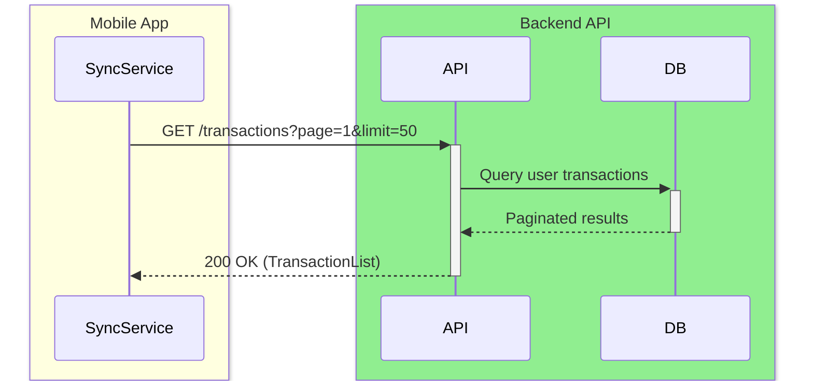

#### 3. Sample Request & Response
**Request (Dart Sample):**
```dart
final response = await dio.get('/transactions', queryParameters: {
  'page': '1',
  'limit': '50',
  'from': '2026-06-01',
  'to': '2026-06-30',
});
```

**Response (JSON):**
```json
{
  "data": [...],
  "total": 42,
  "page": 1
}
```

#### 4. I/O Mapping Specification
| No. | I/O | JSON Key | Dart Type | Nullable | M/O | Format / Values | Dart Model / Field | Logic / Remarks |
|-----|-----|----------|-----------|----------|-----|-----------------|--------------------|--------------------|
| 1 | I | `page` | String | Yes | O | Query param, default `1` | | |
| 2 | I | `limit` | String | Yes | O | Query param, default `50` | | |
| 3 | I | `type` | String | Yes | O | `expense`, `currency_income`, etc. | | |
| 4 | I | `from` | String | Yes | O | `yyyy-MM-dd` | | |
| 5 | I | `to` | String | Yes | O | `yyyy-MM-dd` | | |
| 6 | I | `categoryId` | String | Yes | O | UUID | | |
| 7 | O | `data` | List | No | M | | `List<TransactionData>` | |
| 8 | O | `total` | int | No | M | | | |
| 9 | O | `page` | int | No | M | | | |

#### 5. Status Codes
| Code | Description |
|------|-------------|
| 200 | Success |
| 401 | Unauthorized |

---

### `POST /transactions`

#### 1. Endpoint Overview
| | |
|---|---|
| **API Name** | Create Transaction |
| **Method** | `POST` |
| **Endpoint** | `/transactions` |
| **Description** | Create a single transaction record. Triggers budget alert evaluation after insert. |
| **Flutter Screen** | Via sync push — not called directly from UI |
| **Dart Service** | `SyncService` |

#### 2. Sequence Diagram
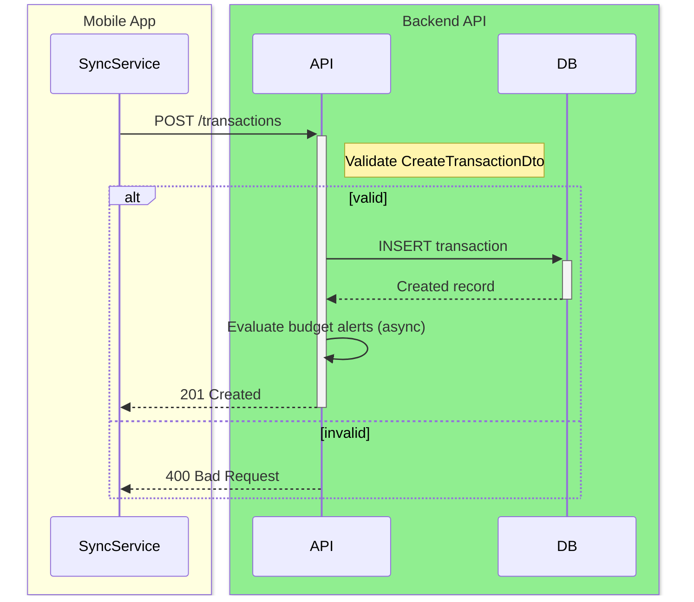

#### 3. Sample Request & Response
**Request (Dart Sample):**
```dart
final response = await dio.post('/transactions', data: transaction.toJson());
```

**Response (JSON):**
```json
{
  "id": "tx-uuid",
  "transactionType": "expense",
  "amountBase": 42.50,
  "originalAmount": 42.50,
  "originalCurrency": "AUD"
}
```

#### 4. I/O Mapping Specification
| No. | I/O | JSON Key | Dart Type | Nullable | M/O | Format / Values | Dart Model / Field | Logic / Remarks |
|-----|-----|----------|-----------|----------|-----|-----------------|--------------------|--------------------|
| 1 | I | `id` | String | No | M | UUID | `TransactionData.id` | |
| 2 | I | `transactionType` | String | No | M | `expense`, `currency_income`, etc. | `TransactionData.transactionType` | |
| 3 | I | `amountBase` | double | No | M | | `TransactionData.amountBase` | Base currency amount |
| 4 | I | `originalAmount` | double | No | M | | `TransactionData.originalAmount` | |
| 5 | I | `originalCurrency` | String | No | M | ISO 4217 | `TransactionData.originalCurrency` | |
| 6 | I | `exchangeRate` | double | No | M | | `TransactionData.exchangeRate` | Historical rate at save time |
| 7 | I | `transactionDate` | String | No | M | ISO8601 | `TransactionData.transactionDate` | |
| 8 | I | `categoryId` | String | Yes | O | UUID | `TransactionData.categoryId` | |
| 9 | I | `note` | String | Yes | O | Max 200 chars | `TransactionData.note` | |
| 10 | I | `exchangeEventId` | String | Yes | O | UUID | `TransactionData.exchangeEventId` | Links exchange pair |

#### 5. Status Codes
| Code | Description |
|------|-------------|
| 201 | Created |
| 400 | Validation error |
| 401 | Unauthorized |

---

## 4. Exchange Rates

### `GET /exchange-rates/latest`

#### 1. Endpoint Overview
| | |
|---|---|
| **API Name** | Get Latest Exchange Rate |
| **Method** | `GET` |
| **Endpoint** | `/exchange-rates/latest` |
| **Description** | Fetch today's exchange rate for a currency pair from backend cache (proxy to Frankfurter). |
| **Flutter Screen** | Transaction Creation / View Currency Display |
| **Dart Service** | `ExchangeRateDao.getMostRecentOrFetch` |

#### 2. Sequence Diagram
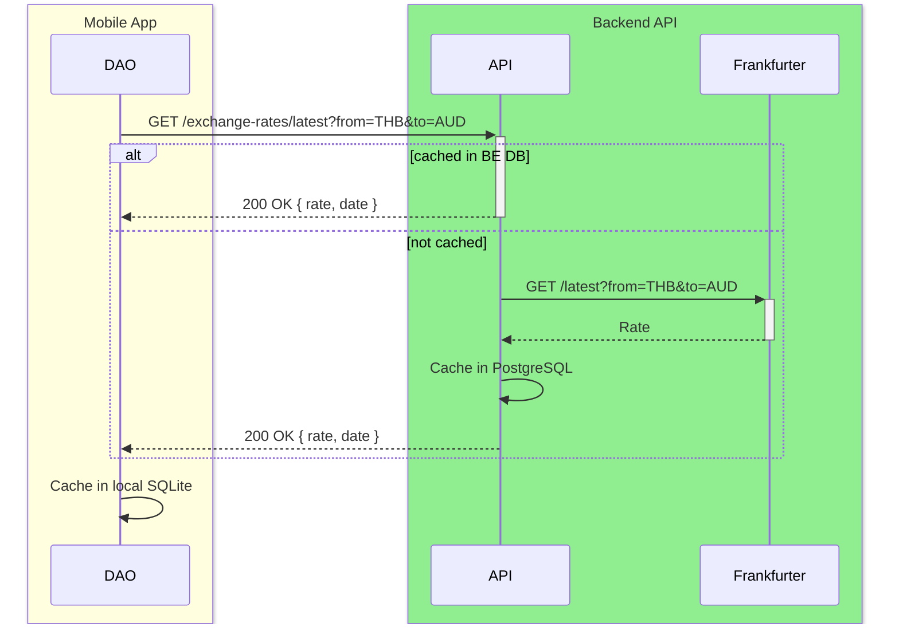

#### 3. Sample Request & Response
**Request (Dart Sample):**
```dart
final response = await dio.get('/exchange-rates/latest', queryParameters: {
  'from': fromCurrency,
  'to': toCurrency,
});
```

**Response (JSON):**
```json
{
  "rate": 22.5,
  "date": "2026-06-21",
  "estimated": false
}
```

#### 4. I/O Mapping Specification
| No. | I/O | JSON Key | Dart Type | Nullable | M/O | Format / Values | Dart Model / Field | Logic / Remarks |
|-----|-----|----------|-----------|----------|-----|-----------------|--------------------|--------------------|
| 1 | I | `from` | String | No | M | Query param, ISO 4217 | | |
| 2 | I | `to` | String | No | M | Query param, ISO 4217 | | |
| 3 | O | `rate` | double | No | M | | | |
| 4 | O | `date` | String | No | M | `yyyy-MM-dd` | | |
| 5 | O | `estimated` | bool | No | M | | | True if fallback was used |

#### 5. Status Codes
| Code | Description |
|------|-------------|
| 200 | Success |
| 401 | Unauthorized |

---

### `GET /exchange-rates/{date}`

#### 1. Endpoint Overview
| | |
|---|---|
| **API Name** | Get Historical Exchange Rate |
| **Method** | `GET` |
| **Endpoint** | `/exchange-rates/{date}` |
| **Description** | Fetch historical exchange rate for a specific date from backend cache (proxy to Frankfurter). |
| **Flutter Screen** | Transaction Creation (backdated expense) |
| **Dart Service** | `ExchangeRateDao.getMostRecentOrFetch` |

#### 2. Sequence Diagram
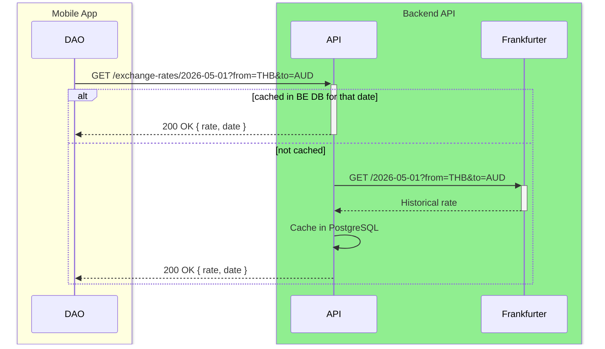

#### 3. Sample Request & Response
**Request (Dart Sample):**
```dart
final dateStr = DateFormat('yyyy-MM-dd').format(transactionDate);
final response = await dio.get(
  '/exchange-rates/$dateStr',
  queryParameters: {'from': fromCurrency, 'to': toCurrency},
);
```

**Response (JSON):**
```json
{
  "rate": 21.8,
  "date": "2026-05-01",
  "estimated": false
}
```

#### 4. I/O Mapping Specification
| No. | I/O | JSON Key | Dart Type | Nullable | M/O | Format / Values | Dart Model / Field | Logic / Remarks |
|-----|-----|----------|-----------|----------|-----|-----------------|--------------------|--------------------|
| 1 | I | `date` | String | No | M | Path param `yyyy-MM-dd` | | |
| 2 | I | `from` | String | No | M | Query param, ISO 4217 | | |
| 3 | I | `to` | String | No | M | Query param, ISO 4217 | | |
| 4 | O | `rate` | double | No | M | | | |
| 5 | O | `date` | String | No | M | `yyyy-MM-dd` | | |
| 6 | O | `estimated` | bool | No | M | | | True if fallback was used |

#### 5. Status Codes
| Code | Description |
|------|-------------|
| 200 | Success |
| 401 | Unauthorized |

---

### `POST /exchange-rates`

#### 1. Endpoint Overview
| | |
|---|---|
| **API Name** | Cache Exchange Rate |
| **Method** | `POST` |
| **Endpoint** | `/exchange-rates` |
| **Description** | Upload a rate fetched directly from Frankfurter by the mobile client (e.g. when backend was unavailable at save time). |
| **Flutter Screen** | Transaction Creation (background, post-save) |
| **Dart Service** | `ExchangeRateDao` |

#### 2. Sequence Diagram
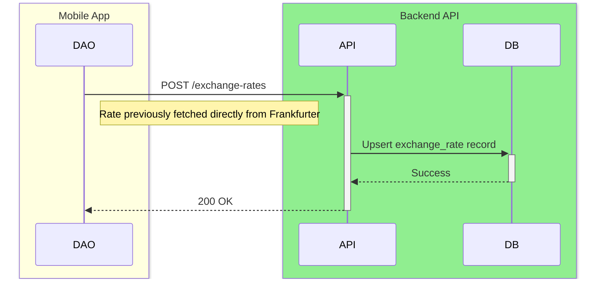

#### 3. Sample Request & Response
**Request (Dart Sample):**
```dart
await dio.post('/exchange-rates', data: {
  'from': 'THB',
  'to': 'AUD',
  'date': '2026-06-21',
  'rate': 0.04453,
});
```

#### 4. I/O Mapping Specification
| No. | I/O | JSON Key | Dart Type | Nullable | M/O | Format / Values | Dart Model / Field | Logic / Remarks |
|-----|-----|----------|-----------|----------|-----|-----------------|--------------------|--------------------|
| 1 | I | `from` | String | No | M | ISO 4217 | | |
| 2 | I | `to` | String | No | M | ISO 4217 | | |
| 3 | I | `date` | String | No | M | `yyyy-MM-dd` | | |
| 4 | I | `rate` | double | No | M | | | |

#### 5. Status Codes
| Code | Description |
|------|-------------|
| 200 | Cached |
| 400 | Invalid payload |
| 401 | Unauthorized |

---

### `GET https://api.frankfurter.app/latest` (External)

#### 1. Endpoint Overview
| | |
|---|---|
| **API Name** | Frankfurter Latest Rate |
| **Method** | `GET` |
| **Endpoint** | `https://api.frankfurter.app/latest` |
| **Description** | Direct external fallback for today's exchange rate when the backend is unavailable or for `getMostRecentOrFetch`. Also used by `ExchangeRateDao.getMostRecentOrFetch`. |
| **Flutter Screen** | Settings (view currency toggle), Transaction Creation |
| **Dart Service** | `ExchangeRateDao.getMostRecentOrFetch` |

#### 2. Sequence Diagram
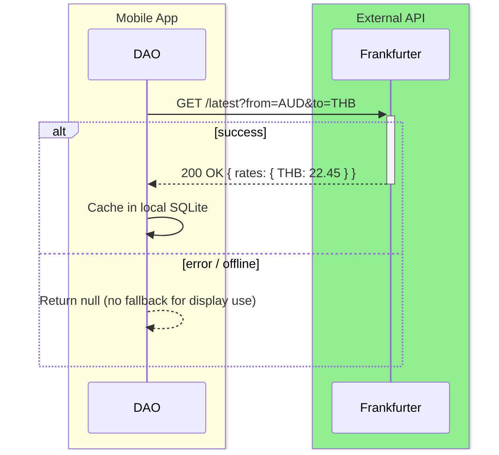

#### 3. Sample Request & Response
**Response (JSON):**
```json
{
  "amount": 1.0,
  "base": "AUD",
  "date": "2026-06-20",
  "rates": {
    "THB": 22.45
  }
}
```

#### 4. I/O Mapping Specification
| No. | I/O | JSON Key | Dart Type | Nullable | M/O | Format / Values | Dart Model / Field | Logic / Remarks |
|-----|-----|----------|-----------|----------|-----|-----------------|--------------------|--------------------|
| 1 | I | `from` | String | No | M | Query param | | Base currency |
| 2 | I | `to` | String | No | M | Query param | | Quote currency |
| 3 | O | `amount` | double | No | M | | | Always 1.0 |
| 4 | O | `base` | String | No | M | | | |
| 5 | O | `date` | String | No | M | `yyyy-MM-dd` | | |
| 6 | O | `rates` | Map | No | M | `{ "THB": 22.45 }` | | Parsed: `rates[quoteCurrency]` |

---

## 5. Import

### `POST /import/transactions`

#### 1. Endpoint Overview
| | |
|---|---|
| **API Name** | Import Transactions |
| **Method** | `POST` |
| **Endpoint** | `/import/transactions` |
| **Description** | Web-only: import a batch of parsed transactions from an Excel file. Mobile handles imports locally (offline-first). |
| **Flutter Screen** | Web only — not called from Flutter mobile |
| **Dart Service** | N/A (Web app only) |

#### 2. Sequence Diagram
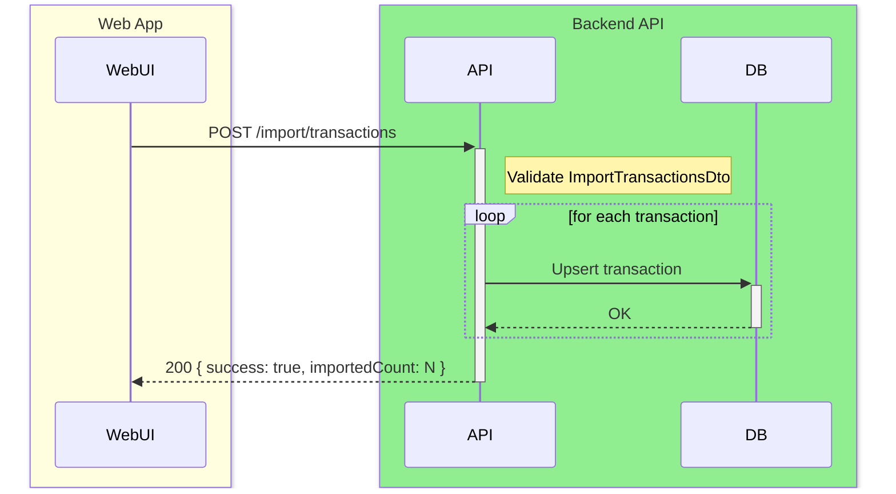

#### 3. Sample Request & Response
**Response (JSON):**
```json
{
  "success": true,
  "importedCount": 42
}
```

#### 4. I/O Mapping Specification
| No. | I/O | JSON Key | Dart Type | Nullable | M/O | Format / Values | Dart Model / Field | Logic / Remarks |
|-----|-----|----------|-----------|----------|-----|-----------------|--------------------|--------------------|
| 1 | I | `transactions` | List | No | M | Array of transaction objects | `ImportTransactionsDto` | |
| 2 | O | `success` | bool | No | M | | | |
| 3 | O | `importedCount` | int | No | M | | | |

#### 5. Status Codes
| Code | Description |
|------|-------------|
| 200 | Import successful |
| 400 | Validation error |
| 401 | Unauthorized |

---

## 6. Export

### `GET /export/excel`

#### 1. Endpoint Overview
| | |
|---|---|
| **API Name** | Export Excel |
| **Method** | `GET` |
| **Endpoint** | `/export/excel` |
| **Description** | Generate and download an Excel (.xlsx) file of the user's transaction data. Optionally filtered by date range. |
| **Flutter Screen** | Settings Screen → Export |
| **Dart Service** | `ExportProvider` / `export_provider.dart` |

#### 2. Sequence Diagram
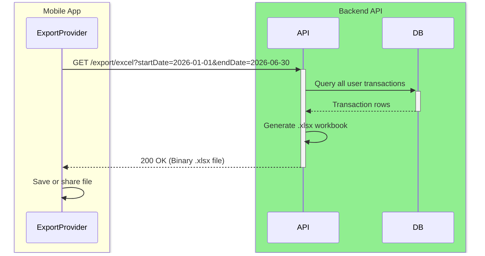

#### 3. Sample Request & Response
**Request (Dart Sample):**
```dart
final response = await dio.get(
  '/export/excel',
  queryParameters: {
    if (startDate != null) 'startDate': startDate.toIso8601String(),
    if (endDate != null) 'endDate': endDate.toIso8601String(),
  },
  options: Options(responseType: ResponseType.bytes),
);
```

**Response:** Binary `.xlsx` file with `Content-Disposition: attachment; filename=project-pet-export-{date}.xlsx`

#### 4. I/O Mapping Specification
| No. | I/O | JSON Key | Dart Type | Nullable | M/O | Format / Values | Dart Model / Field | Logic / Remarks |
|-----|-----|----------|-----------|----------|-----|-----------------|--------------------|--------------------|
| 1 | I | `startDate` | String | Yes | O | Query param, ISO8601 | | Optional filter |
| 2 | I | `endDate` | String | Yes | O | Query param, ISO8601 | | Optional filter |
| 3 | O | *(binary)* | Uint8List | No | M | `.xlsx` bytes | | Saved as file |

#### 5. Status Codes
| Code | Description |
|------|-------------|
| 200 | Excel file stream |
| 400 | Invalid date format |
| 401 | Unauthorized |

---

## 7. Local-only: `ExchangeRateDao` (New in v5.1.0)

> These are not HTTP endpoints — they are local SQLite DAO methods in `lib/core/database/daos/exchange_rate_dao.dart`. Documented here for completeness.

### `getForDateOrRecent(from, to, date) → Future<double?>`

**Purpose:** DB-only rate lookup. Returns the cached rate for the exact date, or the most recently cached rate for that pair. Returns `null` (not 1.0) when nothing is cached.

**Used by:** `txViewAmountProvider` in `shared_providers.dart`

| Parameter | Type | Description |
|-----------|------|-------------|
| `baseCurrency` | String | The "from" currency (e.g. `THB`) |
| `quoteCurrency` | String | The "to" currency (e.g. `AUD`) |
| `date` | DateTime | The transaction date |
| **Returns** | `double?` | Rate, or `null` if no cached rate exists |

**Key rule:** Never makes a network request. Callers must hide the UI element when `null` is returned.

---

*End of document — FLUTTER_API_SPEC.md v5.1.0*
