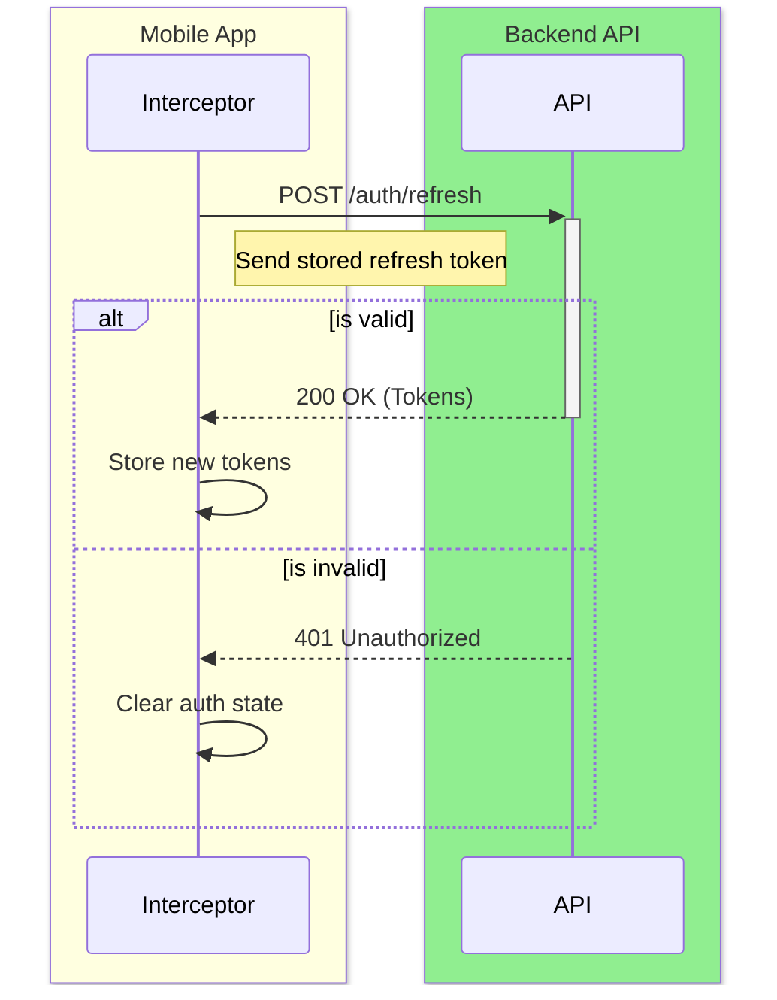
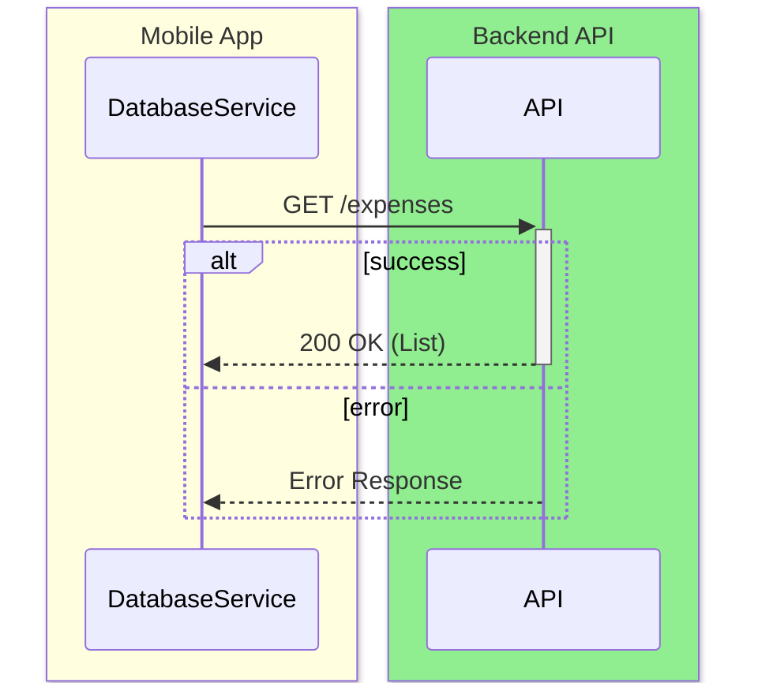
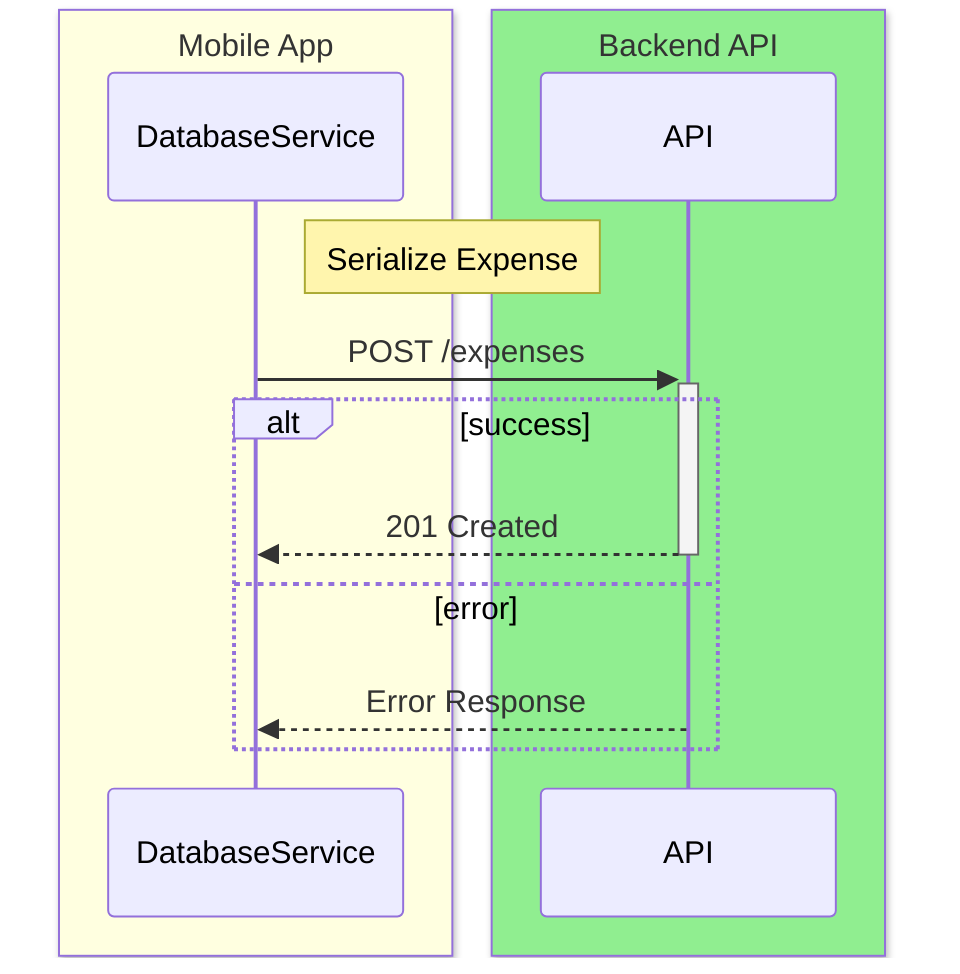
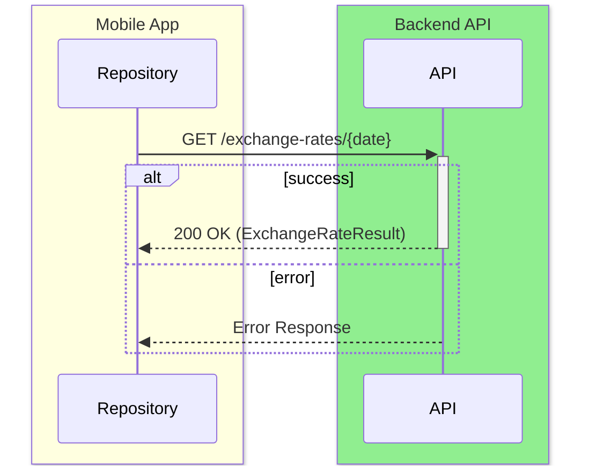
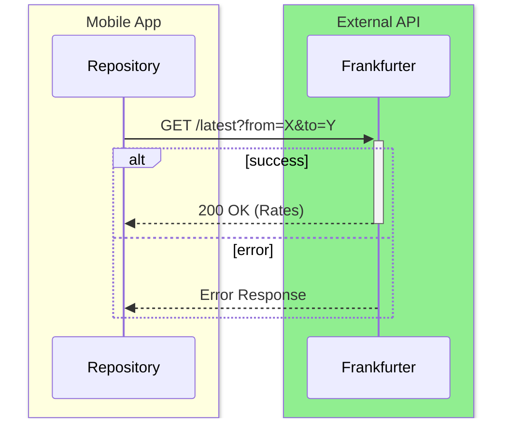

# Flutter API Consumption

**Base URL:** `http://localhost:3000` (configurable via `.env`)

---

## 1. Authentication

### `POST /auth/refresh`

#### 1. Endpoint Overview
| | |
|---|---|
| **API Name** | Refresh Token |
| **Method** | `POST` |
| **Endpoint** | `/auth/refresh` |
| **Description** | Refresh the authentication tokens. |
| **Flutter Screen** | All Screens (via Dio Interceptor) |
| **Dart Service** | `dio_client.dart` / `AuthInterceptor` |

#### 2. Sequence Diagram


#### 3. Sample Request & Response
**Request (Dart Sample):**
```dart
final response = await dio.post('/auth/refresh', data: {
  'refreshToken': refreshToken,
});
```

**Response (JSON):**
```json
{
  "accessToken": "ey...",
  "refreshToken": "ey..."
}
```

#### 4. I/O Mapping Specification
| No. | I/O | JSON Key | Dart Type | Nullable | M/O | Format / Values | Dart Model / Field | Logic / Remarks |
|-----|-----|----------|-----------|----------|-----|-----------------|--------------------|-----------------|
| 1 | I | `refreshToken` | String | No | M | | | Read from secure storage |
| 2 | O | `accessToken` | String | No | M | | | Saved to memory/storage |
| 3 | O | `refreshToken` | String | No | M | | | Saved to storage |

---

## 2. Expenses (Legacy DatabaseService)

### `GET /expenses`

#### 1. Endpoint Overview
| | |
|---|---|
| **API Name** | Get Expenses |
| **Method** | `GET` |
| **Endpoint** | `/expenses` |
| **Description** | Fetch all legacy expenses. |
| **Flutter Screen** | Data loading flows |
| **Dart Service** | `DatabaseService.getAllExpenses` |

#### 2. Sequence Diagram


#### 3. Sample Request & Response
**Request (Dart Sample):**
```dart
final response = await http.get(Uri.parse('$_baseUrl/expenses'));
```

**Response (JSON):**
```json
[
  {
    "id": "exp-123",
    "amount": 42.50,
    "date": "2026-04-27T00:00:00Z",
    "categoryIndex": 1,
    "note": "Lunch",
    "isIncome": false,
    "currencyCode": "AUD"
  }
]
```

#### 4. I/O Mapping Specification
| No. | I/O | JSON Key | Dart Type | Nullable | M/O | Format / Values | Dart Model / Field | Logic / Remarks |
|-----|-----|----------|-----------|----------|-----|-----------------|--------------------|-----------------|
| 1 | O | `rootArray` | List | No | M | | `List<Expense>` | |
| 2 | O | `&nbsp;&nbsp;id` | String | No | M | | `Expense.id` | |
| 3 | O | `&nbsp;&nbsp;amount` | double | No | M | | `Expense.amount` | |
| 4 | O | `&nbsp;&nbsp;date` | DateTime| No | M | | `Expense.date` | |
| 5 | O | `&nbsp;&nbsp;categoryIndex`| int | No | M | | `Expense.categoryIndex` | |
| 6 | O | `&nbsp;&nbsp;note` | String | Yes | O | | `Expense.note` | |
| 7 | O | `&nbsp;&nbsp;isIncome` | bool | No | M | | `Expense.isIncome` | |
| 8 | O | `&nbsp;&nbsp;currencyCode`| String | No | M | | `Expense.currencyCode` | |

---

### `POST /expenses`

#### 1. Endpoint Overview
| | |
|---|---|
| **API Name** | Create Expense |
| **Method** | `POST` |
| **Endpoint** | `/expenses` |
| **Description** | Create legacy transaction. |
| **Flutter Screen** | Legacy transaction creation |
| **Dart Service** | `DatabaseService.insertExpense` |

#### 2. Sequence Diagram


#### 3. Sample Request & Response
**Request (Dart Sample):**
```dart
final response = await http.post(
  Uri.parse(_baseUrl),
  headers: {'Content-Type': 'application/json'},
  body: jsonEncode(_expenseToJson(expense)),
);
```

**Response (JSON):**
*(Empty/None expected directly mapped)*

#### 4. I/O Mapping Specification
| No. | I/O | JSON Key | Dart Type | Nullable | M/O | Format / Values | Dart Model / Field | Logic / Remarks |
|-----|-----|----------|-----------|----------|-----|-----------------|--------------------|-----------------|
| 1 | I | `id` | String | No | M | | `Expense.id` | |
| 2 | I | `amount` | double | No | M | | `Expense.amount` | |
| 3 | I | `date` | DateTime| No | M | ISO8601 | `Expense.date` | |
| 4 | I | `categoryIndex`| int | No | M | | `Expense.categoryIndex` | |
| 5 | I | `note` | String | Yes | O | | `Expense.note` | |
| 6 | I | `isIncome` | bool | No | M | | `Expense.isIncome` | |
| 7 | I | `currencyCode`| String | No | M | | `Expense.currencyCode` | |

---

## 3. Exchange Rates

### `GET /exchange-rates/{date}`

#### 1. Endpoint Overview
| | |
|---|---|
| **API Name** | Get Recommended Rate |
| **Method** | `GET` |
| **Endpoint** | `/exchange-rates/{date}` |
| **Description** | Fetch exchange rate from backend. |
| **Flutter Screen** | Transaction Creation / Portfolio Valuation |
| **Dart Service** | `ExchangeRateRepository.getRecommendedRate` |

#### 2. Sequence Diagram


#### 3. Sample Request & Response
**Request (Dart Sample):**
```dart
final response = await _dio.get(
  '/exchange-rates/$dateStr',
  queryParameters: {'from': baseCurrency, 'to': quoteCurrency},
);
```

**Response (JSON):**
```json
{
  "rate": 22.5,
  "date": "2026-04-27",
  "estimated": false
}
```

#### 4. I/O Mapping Specification
| No. | I/O | JSON Key | Dart Type | Nullable | M/O | Format / Values | Dart Model / Field | Logic / Remarks |
|-----|-----|----------|-----------|----------|-----|-----------------|--------------------|-----------------|
| 1 | I | `date` | String | No | M | Path param | | |
| 2 | I | `from` | String | No | M | Query param | | Base currency |
| 3 | I | `to` | String | No | M | Query param | | Quote currency |
| 4 | O | `rate` | double | No | M | | `ExchangeRateResult.rate` | |
| 5 | O | `date` | String | No | M | | `ExchangeRateResult.date` | |
| 6 | O | `estimated` | bool | No | M | | `ExchangeRateResult.estimated`| True if fallback |

---

### `GET https://api.frankfurter.app/latest`

#### 1. Endpoint Overview
| | |
|---|---|
| **API Name** | Frankfurter Exchange Rate |
| **Method** | `GET` |
| **Endpoint** | `https://api.frankfurter.app/latest` |
| **Description** | Fallback external API for exchange rates. |
| **Flutter Screen** | Portfolio Valuation / Transaction Fallback |
| **Dart Service** | `ExchangeRateRepository.getRecommendedRate` |

#### 2. Sequence Diagram


#### 3. Sample Request & Response
**Request (Dart Sample):**
*(Direct HTTP call in Dart)*

**Response (JSON):**
```json
{
  "amount": 1.0,
  "base": "AUD",
  "date": "2026-04-26",
  "rates": {
    "THB": 22.45
  }
}
```

#### 4. I/O Mapping Specification
| No. | I/O | JSON Key | Dart Type | Nullable | M/O | Format / Values | Dart Model / Field | Logic / Remarks |
|-----|-----|----------|-----------|----------|-----|-----------------|--------------------|-----------------|
| 1 | I | `from` | String | No | M | Query param | | Base currency |
| 2 | I | `to` | String | No | M | Query param | | Quote currency |
| 3 | O | `amount` | double | No | M | | | |
| 4 | O | `base` | String | No | M | | | |
| 5 | O | `date` | String | No | M | | | |
| 6 | O | `rates` | Map | No | M | | | Parsed manually to get `rates[to]` |
