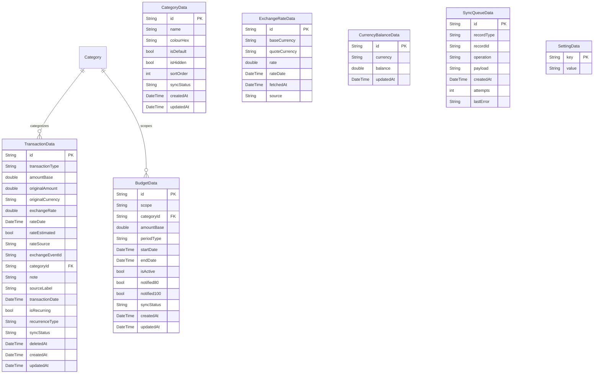

# Local Database Schema

**Technology:** Drift (SQLite)

## ER Diagram

## Tables / Collections

### Table: `transactions`
| Column | Dart Type | SQL/DB Type | Nullable |
|--------|-----------|-------------|----------|
| id | String | TEXT | No |
| transaction_type | String | TEXT | No |
| amount_base | double | REAL | No |
| original_amount | double | REAL | No |
| original_currency | String | TEXT | No |
| exchange_rate | double | REAL | No |
| rate_date | DateTime | INTEGER | No |
| rate_estimated | bool | INTEGER | No |
| rate_source | String | TEXT | No |
| exchange_event_id | String | TEXT | Yes |
| category_id | String | TEXT | Yes |
| note | String | TEXT | Yes |
| source_label | String | TEXT | Yes |
| transaction_date | DateTime | INTEGER | No |
| is_recurring | bool | INTEGER | No |
| recurrence_type | String | TEXT | Yes |
| sync_status | String | TEXT | No |
| deleted_at | DateTime | INTEGER | Yes |
| created_at | DateTime | INTEGER | No |
| updated_at | DateTime | INTEGER | No |

### Table: `categories`
| Column | Dart Type | SQL/DB Type | Nullable |
|--------|-----------|-------------|----------|
| id | String | TEXT | No |
| name | String | TEXT | No |
| colour_hex | String | TEXT | No |
| is_default | bool | INTEGER | No |
| is_hidden | bool | INTEGER | No |
| sort_order | int | INTEGER | No |
| sync_status | String | TEXT | No |
| created_at | DateTime | INTEGER | No |
| updated_at | DateTime | INTEGER | No |

### Table: `budgets`
| Column | Dart Type | SQL/DB Type | Nullable |
|--------|-----------|-------------|----------|
| id | String | TEXT | No |
| scope | String | TEXT | No |
| category_id | String | TEXT | Yes |
| amount_base | double | REAL | No |
| period_type | String | TEXT | No |
| start_date | DateTime | INTEGER | No |
| end_date | DateTime | INTEGER | Yes |
| is_active | bool | INTEGER | No |
| notified_80 | bool | INTEGER | No |
| notified_100 | bool | INTEGER | No |
| sync_status | String | TEXT | No |
| created_at | DateTime | INTEGER | No |
| updated_at | DateTime | INTEGER | No |

### Table: `exchange_rates`
| Column | Dart Type | SQL/DB Type | Nullable |
|--------|-----------|-------------|----------|
| id | String | TEXT | No |
| base_currency | String | TEXT | No |
| quote_currency | String | TEXT | No |
| rate | double | REAL | No |
| rate_date | DateTime | INTEGER | No |
| fetched_at | DateTime | INTEGER | No |
| source | String | TEXT | No |

### Table: `currency_balances`
| Column | Dart Type | SQL/DB Type | Nullable |
|--------|-----------|-------------|----------|
| id | String | TEXT | No |
| currency | String | TEXT | No |
| balance | double | REAL | No |
| updated_at | DateTime | INTEGER | No |

### Table: `sync_queue`
| Column | Dart Type | SQL/DB Type | Nullable |
|--------|-----------|-------------|----------|
| id | String | TEXT | No |
| record_type | String | TEXT | No |
| record_id | String | TEXT | No |
| operation | String | TEXT | No |
| payload | String | TEXT | No |
| created_at | DateTime | INTEGER | No |
| attempts | int | INTEGER | No |
| last_error | String | TEXT | Yes |

### Table: `settings`
| Column | Dart Type | SQL/DB Type | Nullable |
|--------|-----------|-------------|----------|
| key | String | TEXT | No |
| value | String | TEXT | No |
